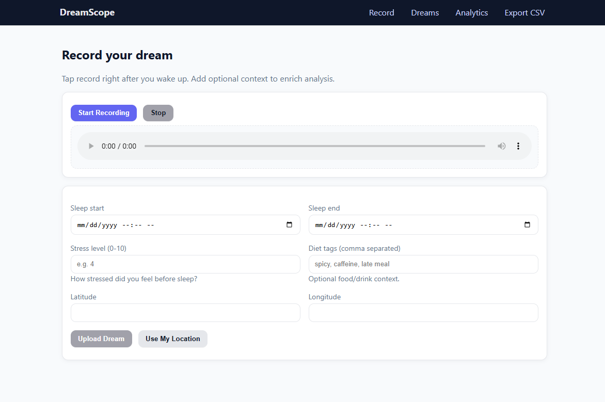

## DreamScope: Offline Crowdsourced Dream Analysis (No API Keys)



DreamScope is a full-stack project to analyze patterns in dream content from crowdsourced voice recordings. It records audio right after waking, transcribes locally (offline), extracts themes/emotions/keywords, and enriches with weather and moon phase.

### What’s included
- Voice recording in the browser (mobile-friendly) with WAV export (no external services)
- Upload audio + metadata (sleep window, stress level, diet tags, optional location)
- Offline transcription via Vosk (free, downloadable model)
- NLP analysis:
  - Sentiment (VADER)
  - Emotions (NRCLex)
  - Keywords (YAKE)
  - Theme tagging (lightweight taxonomy)
- External context:
  - Weather via Meteostat (no API key)
  - Moon phase via Astral (no API key)
- Dashboard, browsing, CSV export, and analysis notebook/script

### Tech stack
- Backend: FastAPI + SQLModel (SQLite) + Jinja2 templates
- NLP: VADER, NRCLex, YAKE
- STT: Vosk offline model (auto-download on first run)
- Frontend: Server-rendered HTML + simple JS recorder

### Quickstart
1) Requirements
- Python 3.10+
- Windows/macOS/Linux

2) Create & activate a virtual environment
```bash
python -m venv .venv
./.venv/Scripts/activate  # Windows PowerShell
# source .venv/bin/activate  # macOS/Linux
```

3) Install dependencies
```bash
python -m pip install --upgrade pip
python -m pip install -r server/requirements.txt
```

4) Run the server (first run auto-downloads the Vosk model ~50–60 MB)
```bash
python -m uvicorn server.main:app --reload
```

Open `http://127.0.0.1:8000` on your phone or desktop.

### Notes
- Audio, DB, and model live under `server/data/` (created automatically).
- If you supply coordinates, weather matching improves; otherwise only moon phase is used.
- CSV export available at `/export.csv` for your data analysis workflows.

